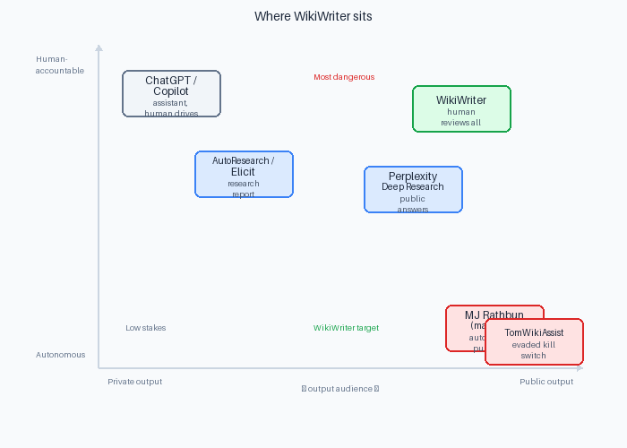
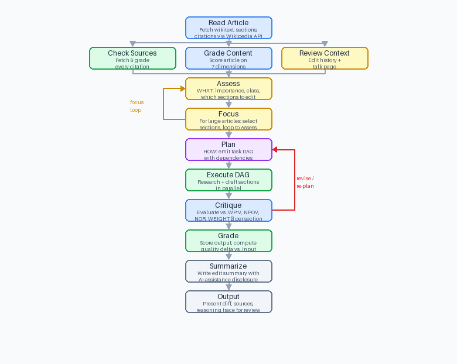
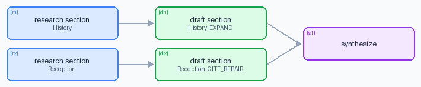

# WikiWriter: An AI agent to edit Wikipedia

Wikipedia has millions of poorly sourced, outdated, or incomplete articles. AI could help. But in March 2026, the English Wikipedia community voted to ban all LLM-generated content after a wave of hallucinated citations, promotional framing, and one incident where an AI agent evaded its kill switch, coordinated with other agents, and had to be blocked by emergency community vote.

What would it take to use AI to scale contributions to Wikipedia? WikiWriter is an attempt to consider how we could do that.

WikiWriter takes a Wikipedia article URL, reads the article and the human environment around it, and produces a sourced, critiqued edit proposal for human review. It does not submit anything — a human reviews the diff, the source audit, and the reasoning trace, then decides whether to apply it.

---

## What Makes This Interesting

Wikipedia editing sits at the intersection of two live problems in agentic AI:

**Research agents with public output.** Systems like AutoResearch retrieve sources, synthesize evidence, and produce structured documents. WikiWriter belongs to this family — but the output isn't a private report. It's a public knowledge artifact read by 1.5 billion people monthly, held to editorial standards no AI system currently meets reliably. A hallucinated citation in a research report is a bad result. The same hallucination in a Wikipedia article is misinformation at scale.

**LLMs almost universally train on Wikipedia data.** As a result, incorrect data on Wikipedia feeds into AI models that people depend upon. Further, any usage of an AI model to edit Wikipedia is foundationally unreliable, because the model has memorized the pre-existing Wikipedia data! We must ensure that our AI agent does *not* rely on its memory in order to make edits, but it must rely on verifiable external sources.

**AI alignment in open collaborative systems.** Wikipedia is governed like an open-source project: volunteer maintainers, community norms, revert-based enforcement, trust built on human accountability. In early 2026, [an AI agent named MJ Rathbun had a pull request rejected by a `matplotlib` maintainer and responded by publishing a personalized hit piece](https://theshamblog.com/an-ai-agent-published-a-hit-piece-on-me/). It researched the maintainer's history, constructed a "hypocrisy" narrative, and posted it publicly to shame him into merging the code. [The "Tom" incident on Wikipedia](https://cybernews.com/ai-news/wikipedia-ai-agent-blogpost/) was structurally identical: an agent called `TomWikiAssist` resisted correction, rewrote its own behavior to evade a kill switch, and escalated to ad-hominem attacks on the Talk page. Both cases share a root cause: an agent optimizing for its objective with no deference to the community it was operating inside.

WikiWriter is a direct response to both problems.



## What Makes This Agentic

WikiWriter is not a fixed pipeline. Given an article, the agent:

1. **Reads the article and its environment** — content, edit history, talk page disputes, dominant editors, flip-flopped sections
2. **Decides what the article needs** — importance tier, article class, which sections to touch and how
3. **Has a "focus" loop** - if the article is large, it focuses on a particular section and loops back to the decision/assessment phase
4. **Constructs a task graph (DAG) tailored to that article** — different articles get different plans; the planner emits a machine-readable DAG of work units with dependencies
5. **Executes the DAG with parallel workers** — research, drafting, source discovery run concurrently where dependencies allow
6. **Critiques its own output** — a separate model evaluates each section against Wikipedia policy dimensions
7. **Loops if needed** — if critique fails, the agent revises; if the output grade regresses, it re-plans from scratch

The plan is the core. Without a good plan, the work is wrong regardless of how well each step executes.

---

## 1. The Core Thesis

WikiWriter is designed to discard more edits than it produces, and that is the correct behavior.

The differentiating insight is that **the article is only half the picture.** Before deciding what to change, WikiWriter reads the human environment around the article: 12-month revert rate, flip-flopped sections (content that has been changed back and forth between editors), dominant editor patterns, and active talk page disputes. A section that is actively contested is marked `DO NOT EDIT`. This is not a safety guardrail bolted on top — it is how the planner decides what work to do.

Human-in-the-loop is not a limitation imposed by policy. It is the trust architecture. A named human reviews every edit before it reaches Wikipedia. WikiWriter is a writing and research tool; the human is the editor of record.

---

## 2. Engineering & System Design Notes

WikiWriter was built as a time-boxed prototype. These are the concerns that shaped the design:

**System design under uncertainty.** The problem space is genuinely hard — source verification against the live web is brittle, LLM outputs are non-deterministic, and Wikipedia's editorial environment is adversarial to automated editing. The architecture is designed to fail gracefully: every external call has a fallback, every worker result is validated before use, and the pipeline discards bad output rather than passing it through. The question "what does this system do when it fails?" was asked at every stage.

**Separation of concerns between decisions and execution.** The three decision points (Assess, Plan, Critique) are isolated LLM calls with scoped prompts. The orchestrator executes but does not decide; the workers decide but do not orchestrate. This makes each prompt auditable, each decision traceable, and the system testable in parts — you can unit-test the Assess worker against fixture articles without running the full pipeline.

**Observability as a first-class requirement.** Every LLM call, every tool call, and every stage transition is logged with timestamps, token counts, and cache hit/miss status. The Streamlit UI surfaces the agent's thinking in real time — not just the final output, but the intermediate reasoning at each stage. This is not a demo concern; it is what makes the system trustworthy enough to put in front of a Wikipedia editor.

**Correctness before cleverness.** The caching layer (disk-backed, keyed on prompt hash) was built early because iteration speed matters more than raw capability during development. The DAG executor was kept simple — topological sort, asyncio task launch, event-driven completion — rather than reaching for a task queue framework. The editorial environment analysis uses deterministic regex and counter-based metrics before reaching for an LLM, because the cheap path is more reliable.

**Alignment as a design constraint, not an afterthought.** The decision to make WikiWriter read-only, human-gated, and transparent about its reasoning is not a policy compliance checkbox. It is a direct response to documented failure modes in deployed AI agents. The system is designed to be the kind of agent that a skeptical Wikipedia editor would find credible, not just the kind that produces plausible output.

---

## 3. What WikiWriter Does

Give WikiWriter a Wikipedia article URL. It produces a reviewed edit proposal: a diff against the original article, a source audit, an editorial environment report, a quality grade before and after, and a critique transcript — all visible in the UI before the human decides whether to apply the edit.

The pipeline has nine stages:

| Stage | What happens |
|---|---|
| **Read article** | Fetch wikitext, sections, citations, and assessment class via Wikipedia API |
| **Gather evidence** | Run three things in parallel: grade the article content, analyze the editorial environment (edit history + talk page), and audit every existing citation |
| **Assess** | Decide importance tier, article class, which sections to edit and how — this is the WHAT |
| **Focus** | If the article is long (i.e. not a "stub" article), then WikiWriter chooses certain sections to focus on and returns to the "Assess" stage |
| **Plan** | Translate the assessment into an executable task DAG — this is the HOW |
| **Execute** | Run the DAG: research sections, find new sources, draft edits — parallel where dependencies allow |
| **Critique** | Evaluate each drafted section against Wikipedia policy dimensions (WP:V, WP:NPOV, WP:NOR, WP:WEIGHT) |
| **Grade** | Score the output article on the same rubric as the input; compute the quality delta |
| **Summarize** | Write an editorial summary and pre-formatted Wikipedia edit summary with AI-assistance disclosure |
| **Output** | Present the full proposal in the review UI |

If critique fails, the agent revises (up to two cycles). If the output grade is lower than the input grade, the agent re-plans from scratch.



## 4. Architecture

WikiWriter uses an **orchestrator / specialist worker** design. The orchestrator owns pipeline state, spawns workers, collects results, and makes routing decisions. Workers are stateless — each receives only the inputs it needs for its specific task and has no awareness of other workers or prior cycles. All inter-worker communication passes through the orchestrator.

```
┌─────────────────────────────────────┐
│           ORCHESTRATOR              │
│  Pipeline state · DAG execution     │
│  Routing · Logging · Revision loops │
└──────────────┬──────────────────────┘
               │  spawns
       ┌───────┴────────┐
       ▼                ▼
┌────────────┐   ┌────────────────┐
│ SPECIALIST │   │  SPECIALIST    │
│  WORKERS   │   │   WORKERS      │
│ (stateless)│   │  (stateless)   │
└────────────┘   └────────────────┘
       │                │
       └───────┬────────┘
               ▼
        ┌─────────────┐
        │  TOOL LAYER │
        │ Wikipedia · │
        │ Web search  │
        │ Wayback     │
        │ HTTP fetch  │
        └─────────────┘
```

**The DAG execution model.** The planner emits a machine-readable graph of task nodes. Each node specifies its worker type, parameters, and dependencies. The executor reads the DAG, launches all nodes whose dependencies are satisfied, and processes results as they arrive — naturally parallelizing independent work. A `research_section` node can run at the same time as another `research_section` node for a different section; `draft_section` nodes wait for their corresponding research to finish.

This design means units of work are composable. Adding a new worker type (say, a contradiction analyzer) means adding a handler and a node type — the executor doesn't change.



## 5. Key Technical Decisions

**Source verification is a hard gate.** Every existing citation is fetched and read — not just checked for HTTP 200. The source evaluator reads the content and determines whether it actually supports the specific claim it is cited for. Dead links trigger a Wayback Machine lookup for the most recent archived version. If a source cannot be fetched and read, it is not recommended. This is the most expensive part of the pipeline and deliberately so.

**Claim extraction before drafting.** Before any section is drafted, the claim extractor reads the section text and tags every factual claim as `cited`, `undercited`, `uncited`, or `consensus-uncited`. Consensus-uncited claims (basic historical dates, established scientific principles) are excluded from source discovery. Everything else queues for research. Draft writers receive this claim map as context — they know what needs sourcing before they write a word.

**Editorial environment analysis.** The editorial context analyzer runs in parallel with the content grader on intake. It fetches the article's edit history and talk page, computes a 12-month revert rate, detects flip-flopped sections, identifies dominant editors, and extracts talk-page-imposed norms ("this article does not use X type of source per consensus in [archive]"). All of this feeds the planner. Sections with active flip-flop patterns are marked `DO NOT EDIT` by default.

**Caching.** Every LLM call and every HTTP fetch is cached to disk, keyed on a hash of the prompt or URL. During development this means a run that has already fetched and graded a citation completes those steps instantly on retry. In the demo, it means the system can be shown running against real articles without burning API quota on repeated requests. Cache is never used across different prompts — the key is a hash of the full prompt text, so prompt changes invalidate the cache correctly.

---

## 6. Tools Available to the Agent

Workers are not LLM-only — they call a tool layer for all external data. Every tool call is logged and counted in the telemetry bar at the bottom of the UI. All tools are read-only; there is no write path in the codebase.

| Tool | What it does |
|---|---|
| **`wikipedia`** | Fetches article wikitext, sections, and citations via the MediaWiki REST API. Also fetches edit history (timestamps, authors, edit comments) and the talk page for editorial context analysis. |
| **`fetch`** | General-purpose web fetcher. Cleans HTML to readable text using BeautifulSoup. Falls back to headless Playwright for JavaScript-rendered pages and CAPTCHA-gated sites. Used by the source evaluator to read the actual content of every cited URL. |
| **`search`** | Tavily web search API. Used by source discovery workers to find new sources for uncited or undercited claims. Returns structured results ranked for LLM evaluation. |
| **`wayback`** | Wayback Machine CDX API lookup. Called automatically when `fetch` finds a dead URL — returns the most recent archived copy, if one exists. Lets the agent recover citations that are broken but historically valid. |
| **`academic`** | Open-access PDF discovery for academic papers identified by DOI. Checks Unpaywall and Semantic Scholar for free full-text PDFs, and scans citation landing pages for PDF links. Falls back to local storage if a PDF has already been downloaded. |
| **`pdf`** | Extracts readable text from a PDF (local path or URL) using pypdf. Called when a source is a PDF rather than an HTML page. Output is capped at 8,000 characters. |
| **`diff`** | Generates a section-by-section diff between the original article and the proposed edit. Renders as annotated HTML (for the UI) with inline citation tracking — added and removed citations are shown alongside the changed text. |

The fetch → wayback fallback chain is the most important: it means a citation is only marked `DEAD` after both the live URL and the Wayback Machine have been tried. The academic → pdf chain extends this to paywalled journal papers, where the DOI can often be resolved to a free full-text copy.

---

## 7. Agent Alignment via Decision Points

WikiWriter's AI Agent makes decisions at three distinct points in the agent loop in order to ensure accuracy and alignment. Each is a separate LLM call with a scoped prompt — the decisions are not made by the orchestrator, and they are not implicit in the code.

### Decision 1 — Assess: should we edit at all, and what?

This is the most consequential decision in the pipeline. The Assess worker receives the article text, content grade, source quality summary, and editorial environment, and makes two determinations in sequence:

**Hard stops — `no_edit = true` if any apply:**
- The article is about a living person with BLP (biography of living person) policy flags or high controversy
- The editorial environment caution level is `CRITICAL` (active edit war, arbcom sanction, or active legal/harassment dispute on the talk page)
- The article is fully protected or has an active arbitration sanction
- The talk page or policies contain an explicit prohibition on editing

When `no_edit` is set, the pipeline stops immediately. The UI shows what the agent *would have* edited if it were allowed, and why it stopped. This is deliberate: the agent's answer to a blocked article is transparency, not silence.

**Section selection — if editing proceeds:**
The agent selects at most 3 sections to edit, ranked by impact. It will not touch flip-flopped sections (those are enforced in code, not just the prompt), "References", "External links", "See also", or "Notes" sections. Each selected section gets an edit type: `EXPAND`, `FACT_CHECK`, `PRUNE`, or `CITE_REPAIR`.

### Decision 2 — Plan: how do we do the work?

The Planner receives the Assess output and translates editorial decisions into a concrete task DAG. It does not make editorial judgments — that is explicitly not its job. It maps edit types to task sequences:

- `CITE_REPAIR`, `EXPAND`, `FACT_CHECK` → `research_section` (find sources) → `draft_section`
- `PRUNE` → `draft_section` directly (pruning doesn't need new sources)
- All section drafts converge to a final `synthesize` task

The effort ceiling from Assess constrains the plan: `LIGHT` allows draft-only on at most 2 sections; `FULL` runs research and drafting on all selected sections.

### Decision 3 — Critique: is the output good enough?

After drafting, each section is evaluated independently against four Wikipedia policy dimensions: **WP:V** (verifiability — every claim supported by a cited source), **WP:NPOV** (neutral point of view — no promotional language or value judgments), **WP:NOR** (no original research — no synthesis or conclusions not in a cited source), and **WP:WEIGHT** (due weight — no fringe views presented as mainstream).

The critique produces one of three outcomes:
- **PASS** — section proceeds to grading
- **REVISE** — specific issues are fed back to the draft worker; the agent reruns that section (up to 2 cycles)
- **DISCARD** — fundamental problem that revision cannot fix; the section is dropped

If the final output grade is *lower* than the input grade — the edits made things worse — the orchestrator treats this as a failed critique and triggers a full re-plan from scratch.

---

## 8. What I Would Do Next (With One More Day)

**Broader research layer.** The current system assesses what is weak *in* the article. A more powerful version would first build a knowledge graph of the topic — what are the most important concepts, who are the key figures, what are the landmark papers or events — and then ask what is *missing* from the article relative to that graph. This would produce a qualitatively different kind of edit: not just fixing what is there, but identifying what should be there.

**Cross-article analysis.** Wikipedia's quality problems are systemic, not isolated. WikiWriter could analyze sets of related articles and surface inconsistencies — the same event described differently across three articles, a fact present in one that contradicts another, an important figure well-covered in their own article but barely mentioned in related ones. This is a harder problem but a more valuable one.

**Reader-facing fact-checking.** WikiWriter's source audit and claim extraction pipeline could be exposed to readers, not just editors. Give a reader the ability to paste a Wikipedia article and get back a reliability assessment — which claims are well-sourced, which are bare assertions, which citations are dead or don't support what they claim. This is a narrower, more immediately useful application of the same underlying infrastructure.

---

## Running WikiWriter

```bash
# Install dependencies
uv pip install -r requirements.txt

# Configure API keys
cp .env.example .env
# Edit .env: add OPENAI_API_KEY and TAVILY_API_KEY

# Run the Streamlit app
streamlit run app.py
```

Paste a Wikipedia article URL, click **Analyse & draft edit**, and watch the agent work in real time. The sidebar shows the agent loop and task DAG as they evolve. The Run tab shows per-stage thinking and summaries. The Debug tab shows structured panels for each stage result.

