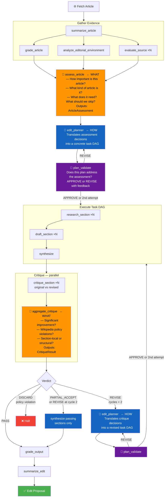
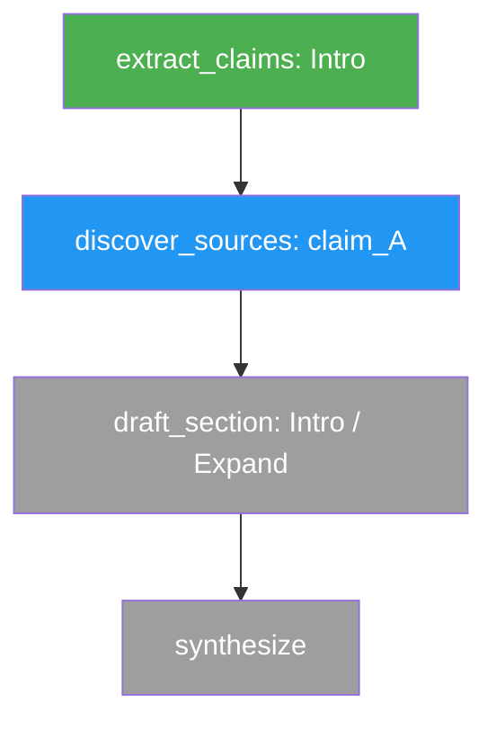

# WikiWriter v2: DAG-Based Agent Architecture

## Design Principle

The current system is a fixed pipeline. Every article goes through the same stages in the same order, and decisions (which sections to edit, how to revise after critique) are shallow and deterministic.

In v2, the same two-step pattern repeats throughout: a **"what"** decision followed by a **"how"** translation into tasks.

- **`assess_article`** — the hardest "what". With full context (article, grades, editorial environment, source quality), decides: how important is this article, what does it need, and what should we explicitly *not* do. Produces an `ArticleAssessment` with high-level editorial decisions.
- **`edit_planner`** — always the "how". An LLM that receives high-level instructions (from assessment or critique) and translates them into a concrete executable task DAG. It is always an LLM because its inputs may be prose, structured data, or a mix — and it needs to interpret them intelligently regardless. Its knowledge of the task vocabulary lets it pick the right task types and wire dependencies correctly.
- **`aggregate_critique`** — the critique "what". Evaluates per-section results and produces high-level feedback on what needs to change. This feedback feeds directly into `edit_planner`, which interprets it and decides what tasks to run.

The executor just runs whatever DAG `edit_planner` produces. It has no opinions.

---

## Architecture Overview



---

## Step 1 — Gather Evidence

### `summarize_article` (runs first, before the parallel tasks)

An LLM call that reads the full article text and produces a brief `ArticleSummary`: what this article is about and what its scope covers (what's included and what's explicitly out of scope). This summary is passed to every `evaluate_source` call so sources can be assessed for relevance against the actual topic, not just the title.

```python
class ArticleSummary(BaseModel):
    topic: str   # what this article is about, in 1-2 sentences
    scope: str   # what is included and what is not — used to judge source relevance
```

### Parallel tasks (all depend on `summarize_article`)

Each may use an LLM internally, but none makes decisions about what other tasks to run — they collect and structure data for `assess_article`.

```
summarize_article ──┬──→ grade_article                    ──┐
                    ├──→ analyze_editorial_environment    ──┤
                    ├──→ evaluate_source(url_1)           ──┤
                    ├──→ evaluate_source(url_2)           ──┤
                    └──→ evaluate_source(url_N)           ──┘
                                                             └──→ assess_article
```

**Note on scale:** for heavily-cited articles (50+ citations), source evaluation is capped at 20, sampled to prioritise citations for sections most likely to be edited.

---

## Step 2 — Assess (WHAT)

### `assess_article`

The most important decision in the system. Receives all evidence from Step 1 and answers:

**Importance** — How important is this article to Wikipedia's mission? What level of depth is appropriate? Does it warrant full editorial effort or a lighter touch?

**Classification** — What kind of article is this? Stub / developing / complete / over-detailed.

**What to do** — What does it need? Expand, fact-check, prune, cite-repair, add-sections — and in which sections? What should we explicitly skip?

**Source quality** — Are existing sources trustworthy enough to build on, or does the edit plan need to prioritise heavy re-sourcing?

Output: `ArticleAssessment` — a structured list of editorial decisions. This is the input to `edit_planner`.

---

## Step 3 — Plan (HOW)

### `edit_planner` — first call

Receives `ArticleAssessment` (high-level editorial decisions) and translates them into a concrete executable task DAG. It is an LLM call — the assessment may contain prose rationale, nuanced section-level judgments, and qualitative instructions that require interpretation, not just mechanical mapping.

It decides:
- Which task types to emit for each section (`research_section`, `draft_section`, `synthesize`)
- Task ordering and dependencies
- Which sections to skip
- Sourcing effort per section — constrained by `effort_ceiling`

`edit_planner` has no editorial opinions. It does not decide *what* the article needs — that came from `assess_article`. It decides *how* to execute those decisions as tasks.

Note: `research_section(section)` is the correct unit for sourcing work. It handles claim extraction and source discovery internally — the planner works at section granularity, not individual claim granularity.

Example DAG for a developing article needing citation repair and expansion:
```
research_section(intro)    ──→ draft_section(intro, CiteFix) ──┐
research_section(history)  ──→ draft_section(history, Expand) ─┤
                                                                └──→ synthesize
```

Example DAG for an over-detailed article (no research needed):
```
draft_section(reception, Prune) ──┐
draft_section(trivia, Prune)    ──┴──→ synthesize
```

Existing source evaluations from Step 1 are passed through — `edit_planner` does not re-emit `evaluate_source` for already-checked URLs.

---

## Step 3b — Plan Validation

Before the DAG executes, a lightweight LLM call reviews the plan. Execution is expensive — this is the cheap checkpoint.

The validator receives: the `ArticleAssessment` (or `CritiqueResult` on revision), the proposed task list, and the task vocabulary. It answers:

- Does this plan actually address what the assessment/critique asked for?
- Are there obvious missing tasks (e.g. a section marked for CiteFix but no `research_section` before it)?
- Are there redundant or contradictory tasks?

Returns `APPROVE` or `REVISE` with specific feedback. If `REVISE`, `edit_planner` regenerates the plan once with the feedback appended. Maximum one validation retry — if the second plan also fails validation, proceed anyway and let the critique catch any remaining issues.

---

## Step 4 — Execute

The DAG executor runs whatever `edit_planner` produced. No opinions, no decisions. See DAG Executor section.

---

## Step 5 — Critique (WHAT)

### `critique_section`

Evaluates one edited section against the original. The central question is not "is this perfect?" but **"is this a significant improvement over the current Wikipedia version?"** — a bar that is achievable and meaningful.

Each `critique_section` call receives:
- `original_section_text` — the current Wikipedia text (for comparison)
- `revised_section_text` — the draft
- `source_report` — available sources, to verify citation claims

Dimensions map to Wikipedia's core content policies:

| Dimension | Policy | Passes if |
|-----------|--------|-----------|
| `verifiability` | WP:V | All significant claims have or can have citations |
| `neutrality` | WP:NPOV | No promotional tone, undue weight, or one-sided framing |
| `no_original_research` | WP:NOR | No novel synthesis or unpublished conclusions |
| `due_weight` | WP:WEIGHT | Minority views not over-represented vs. mainstream sources |
| `improvement` | — | Revised text is a net improvement over the original |

A section PASSES if `improvement` passes and no policy dimension has a hard failure. Minor issues in non-policy dimensions are noted but do not block acceptance.

### `aggregate_critique`

Synthesises section results and decides:

**Overall verdict**: `PASS` / `REVISE` / `PARTIAL_ACCEPT` / `DISCARD`

- `PASS` — all sections improved, no policy violations
- `REVISE` — some sections failed but are fixable (within revision budget)
- `PARTIAL_ACCEPT` — revision budget exhausted; passing sections are accepted, failing sections revert to original
- `DISCARD` — only if there are hard policy violations (BLP, severe NPOV) that cannot be safely submitted even partially

**Scope** — are failures section-local (`SECTIONS`) or structural (`FULL_ARTICLE`)?

**Per-section instructions** — specific, actionable feedback for the re-planner on each failing section.

Output: `CritiqueResult` — feeds into `edit_planner` on revision, same pattern as `ArticleAssessment`.

---

## Step 6 — Re-plan if needed (HOW)

### `edit_planner` — revision call

Receives `CritiqueResult` instead of `ArticleAssessment`, but does the same job: translate a "what" list into a concrete task DAG.

- If `revision_scope == SECTIONS`: emits targeted redraft tasks, optionally preceded by `research_section` if failures are sourcing gaps
- If `revision_scope == FULL_ARTICLE`: emits `draft_full_article`

Loops back to Step 3b (validation) → Step 4 (execute) → Step 5 (critique).

**Verdict routing after critique:**

| Verdict | Action |
|---------|--------|
| `PASS` | Proceed to `grade_output` → `summarize_edit` → done |
| `REVISE` (cycles < 2) | Re-plan and execute again |
| `REVISE` (cycles = 2) | Treat as `PARTIAL_ACCEPT` — accept passing sections |
| `PARTIAL_ACCEPT` | `synthesize` using passing section drafts + original text for failing sections |
| `DISCARD` | Halt — only for hard policy violations (BLP, severe NPOV) |

**Partial acceptance** means the final `EditProposal` contains a mix of improved and unchanged sections. `EditSummary` explicitly identifies which sections were improved and which reverted to original, and why.

---

## Data Models

### `ArticleImportance` (new)
```python
class ArticleImportance(BaseModel):
    tier:           Literal["VITAL", "MAJOR", "NOTABLE", "MINOR"]
    rationale:      str    # why this article matters (or doesn't) to Wikipedia's mission
    expected_depth: str    # what level of coverage is appropriate: brief / solid / comprehensive
```

`tier` drives `effort_ceiling`:
- `VITAL` / `MAJOR` → `FULL` effort
- `NOTABLE` → `MODERATE` effort
- `MINOR` → `LIGHT` effort

### `ArticleAssessment` (new)
```python
class SectionDecision(BaseModel):
    name:      str
    action:    Literal["EDIT", "SKIP"]
    edit_type: Literal["EXPAND", "FACT_CHECK", "PRUNE", "CITE_REPAIR"] | None  # None if SKIP
    rationale: str

class ArticleAssessment(BaseModel):
    importance:             ArticleImportance
    article_class:          Literal["STUB", "DEVELOPING", "COMPLETE", "OVER_DETAILED"]
    effort_ceiling:         Literal["FULL", "MODERATE", "LIGHT"]   # derived from importance.tier
    edit_scope:             Literal["WHOLE_ARTICLE", "SPECIFIC_SECTIONS"]
    sections:               list[SectionDecision]   # per-section decisions — EDIT or SKIP with rationale
    primary_weaknesses:     list[str]
    source_quality_summary: str
    edit_rationale:         str    # plain-language: why are we editing this?
```

`edit_scope` tells the planner whether the article needs broad treatment (`WHOLE_ARTICLE`) or targeted work on specific sections (`SPECIFIC_SECTIONS`). `sections` gives explicit per-section direction so the planner doesn't have to re-derive it.

Note: `ADD_SECTIONS` (new section creation) is deferred to v3.

### `EditorialEnvironment` (replaces `EditorialRiskProfile`)
```python
class EditorialEnvironment(BaseModel):
    # Deterministic metrics from edit history
    revert_rate_12mo:          float
    edit_velocity:             int           # non-bot, non-revert edits in last 12 months
    dominant_editor:           str | None    # editor with >40% of recent edits
    active_topics:             list[str]     # sections people have been actively working on
    flip_flopped_sections:     list[str]     # sections with back-and-forth editing

    # LLM talk-page analysis
    active_disputes:           list[dict]
    resolved_disputes:         list[dict]
    editor_imposed_norms:      list[str]     # e.g. "use British English"
    policies_and_restrictions: list[str]     # e.g. semi-protected, BLP, ARBCOM
    wikiproject_affiliations:  list[str]
    environment_narrative:     str

    # Derived: how cautious should the planner be?
    caution_level: Literal["LOW", "MODERATE", "HIGH", "CRITICAL"]
```

### `SourceEvaluation` (modified)
```python
class SourceEvaluation(BaseModel):
    url:                    str
    status:                 Literal["LIVE", "ARCHIVED", "DEAD"]
    domain_type:            str
    scores:                 dict[str, float]   # topic_relevance replaces claim_support
    overall_score:          float
    author:                 str | None = None
    publication:            str | None = None
    publication_date:       str | None = None
    topic_coverage_summary: str                # what aspects of the topic this source covers
    recommendation:         Literal["USE", "WEAK", "REJECT"]
    claims:                 list[str]          # all factual claims about the topic found in this source
```

`claim` parameter removed from `evaluate_source`. `claims` replaces `further_claims` — every source returns the full set of claims it supports regardless of why it was fetched. Score dimension `claim_support` → `topic_relevance`.

### `SectionCritiqueResult` (new)
```python
class SectionCritiqueResult(BaseModel):
    section_name:  str
    verdict:       Literal["PASS", "FAIL"]
    dimensions:    dict[str, DimensionCritique]
    issues:        list[str]
    suggested_fix: str    # specific instruction for the Edit Planner on revision
```

### `CritiqueResult` (extended)
```python
# Add to existing model:
    section_results:  dict[str, SectionCritiqueResult]
    revision_scope:   Literal["SECTIONS", "FULL_ARTICLE"] | None
    overall_verdict:  Literal["PASS", "REVISE", "PARTIAL_ACCEPT", "DISCARD"]
    passing_sections: list[str]   # sections accepted even on PARTIAL_ACCEPT
    failing_sections: list[str]   # sections that revert to original on PARTIAL_ACCEPT
```

---

## Units of Work

### Assessment
| Type | Inputs | Outputs |
|------|--------|---------|
| `summarize_article` | WikiArticle | ArticleSummary |
| `grade_article` | WikiArticle | ContentGrade |
| `analyze_editorial_environment` | WikiArticle | EditorialEnvironment |
| `evaluate_source` | url, ArticleSummary | SourceEvaluation |
| `assess_article` | WikiArticle, ArticleSummary, ContentGrade, EditorialEnvironment, list[SourceEvaluation] | ArticleAssessment |

`evaluate_source` is the atomic web-fetch-and-evaluate unit. It is used directly in Gather Evidence (existing citations) and internally by `research_section` (candidate URLs from search).

### Content Acquisition Pipeline (critical)

A source we cannot read is worthless. Before any LLM evaluation runs, `evaluate_source` works through a staged acquisition strategy to maximise the chance of getting readable content:

```
1. Direct fetch (fetch_readable)
      ↓ if thin/blocked/paywalled
2. LLM page inspection — receives raw HTML, identifies:
      - PDF download links ("Download PDF", ".pdf" hrefs, "/pdf/" paths)
      - DOI links → resolve and retry
      - Author manuscript links
      - "Access via institution" or similar paywalled signals
      ↓ if PDF or alternative URL found
3. Fetch the PDF / alternative URL
      ↓ if still inaccessible
4. Open-access fallback (for academic content):
      - Unpaywall API (by DOI)
      - arXiv / bioRxiv / SSRN if identifiable as a preprint
      ↓ if still inaccessible
5. Wayback Machine archive
      ↓ if all strategies exhausted
6. Mark DEAD — score 0, recommendation REJECT
```

**Key decisions:**
- Steps 1–3 always run. Steps 4–5 run only if the LLM inspection identifies the source as academic/paywalled.
- The LLM inspection in step 2 receives the raw HTML of the landing page and returns a structured verdict: `{ "content_type": "academic|news|blog|other", "accessible": bool, "pdf_url": str|null, "doi": str|null, "open_access_likely": bool }`.
- A page that loads but is mostly nav/boilerplate (thin content) is treated the same as blocked — the LLM flags it in step 2.
- PDF content is extracted as text before being passed to the evaluation LLM.

This logic lives entirely inside `evaluate_source`. No caller needs to know which strategy succeeded.

### Research
| Type | Inputs | Outputs |
|------|--------|---------|
| `research_section` | WikiArticle, section_name, ArticleSummary | SectionResearch |

`research_section` is a compound task. Internally it:
1. Extracts claims from the section, identifies uncited ones
2. For each uncited claim, runs a web search returning 20 candidate URLs (filtered through `BAD_SOURCES`)
3. **LLM relevance ranking**: given the 20 search result snippets + `ArticleSummary`, an LLM picks the top 5 most likely to contain usable content — before any fetching occurs. This avoids spending fetch budget on obviously irrelevant results.
4. Calls `evaluate_source(url, ArticleSummary)` in parallel for those top 5 per claim
5. Returns the highest-scoring usable sources across all claims

`evaluate_source` is the shared atomic unit — the same call used in Gather Evidence for existing citations. Any rate limiting or caching on `evaluate_source` applies to both uses automatically.

**`SectionResearch`** (new model):
```python
class SectionResearch(BaseModel):
    section_name:  str
    claim_map:     ClaimMap               # all claims with citation status
    new_sources:   list[SourceEvaluation] # sources found for uncited claims, via evaluate_source
```

**Search behaviour:**
- 20 candidate URLs per claim from web search, filtered through `BAD_SOURCES`
- LLM relevance ranking selects top 5 to actually fetch and evaluate
- `evaluate_source` calls for those 5 run in parallel
- Internal retry per claim: if fewer than 2 usable sources returned, retry with reformulated query (up to 2 times)

This keeps the worst-case fetch count at **5 URLs × N uncited claims** per section, making parallel `research_section` tasks feasible.

### Edit
| Type | Inputs | Outputs |
|------|--------|---------|
| `draft_section` | SectionPlan, WikiArticle, source_report, editor_norms | SectionDraft |
| `draft_full_article` | WikiArticle, assembled_draft, CritiqueResult, source_report | str |
| `synthesize` | WikiArticle, list[SectionDraft], source_report | assembled_draft: str |

`draft_section` modes: Expand, Rewrite, CiteFix, Prune. (`NewSection` deferred to v3.)
`draft_full_article` is emitted only when `revision_scope == FULL_ARTICLE`.

### Critique & Output
| Type | Inputs | Outputs |
|------|--------|---------|
| `critique_section` | section_name, original_text, revised_text, source_report | SectionCritiqueResult |
| `aggregate_critique` | list[SectionCritiqueResult], assembled_draft | CritiqueResult |
| `grade_output` | assembled_draft, WikiArticle | ContentGrade |
| `summarize_edit` | WikiArticle, assembled_draft, ArticleAssessment, list[SectionDraft], CritiqueResult | EditSummary |

### `EditSummary` (new)
```python
class EditSummary(BaseModel):
    narrative:      str    # 2-4 paragraphs: what the article needed, what approach was taken, why
    sections_changed: list[str]
    disclosure_line: str   # short one-liner for the Wikipedia edit summary box
```

`summarize_edit` is an LLM call that has access to everything: the original article, the final draft, the `ArticleAssessment` (why we edited it, what it needed), all `SectionDraft` objects (what changed in each section), and the `CritiqueResult` (what was accepted or revised). It writes a human-readable account of the editorial approach — not a diff, not a changelog, but a synthesis: *why this article needed work, what strategy was chosen, and what the edit actually accomplished*. This is what a thoughtful human editor would write in a talk-page note after a significant edit.

---

## DAG Executor

A lightweight asyncio executor. Task types are fixed and known — this is not a general-purpose engine.

```python
@dataclass
class TaskNode:
    id:     str
    type:   TaskType
    params: dict
    deps:   list[str]
    status: Literal["pending", "running", "done", "failed"] = "pending"
    result: Any | None = None
```

Execution loop:
1. Find all `pending` nodes whose deps are all `done` → launch concurrently
2. As each completes, store result, update status, yield `ProgressEvent`
3. If a node fails, mark dependents `failed`, yield error event
4. Halt when all nodes are `done` or `failed`

Results stored in `dict[task_id → result]`, passed to each task at execution time.

---

## Edit Planner Output Schema

```json
{
  "tasks": [
    {
      "id": "t1",
      "type": "research_section",
      "params": { "section": "Introduction" },
      "deps": []
    },
    {
      "id": "t2",
      "type": "research_section",
      "params": { "section": "History" },
      "deps": []
    },
    {
      "id": "t3",
      "type": "draft_section",
      "params": { "section": "Introduction", "mode": "CiteFix" },
      "deps": ["t1"]
    },
    {
      "id": "t4",
      "type": "draft_section",
      "params": { "section": "History", "mode": "Expand" },
      "deps": ["t2"]
    },
    {
      "id": "t5",
      "type": "synthesize",
      "params": {},
      "deps": ["t3", "t4"]
    }
  ],
  "narrative": "Introduction and History have the lowest citation density per assessment. Reception skipped — flip-flopped. Effort ceiling: MODERATE per importance tier."
}
```

Planner prompt provides: full task vocabulary with signatures, `ArticleAssessment` (including importance), hard constraints (flip-flopped sections, caution_level), and on revision: `CritiqueResult` with per-section feedback.

---

## Live DAG Visualization (Streamlit)

A sidebar panel renders the current DAG as a live Mermaid flowchart, updated as tasks change state. Rendered via `st.html` with inline mermaid.js.



Panel also shows:
- Current cycle (Assessment / Edit cycle 1 / Edit cycle 2)
- `ArticleImportance` tier and rationale once Phase 1 completes
- `article_class` and `edit_types` from `ArticleAssessment`

---

## What Replaces What

| v1 | v2 |
|----|-----|
| Fixed 8-stage pipeline | WHAT→HOW→EXECUTE loop, repeated on revision |
| `Planner` worker (sections + modes only) | `assess_article` (WHAT) + `edit_planner` (HOW) — separated by concern |
| `ArticleGrader` + `EditorialContextAnalyzer` → done | Gather Evidence step: same workers + source eval, feeding `assess_article` |
| No importance assessment | `ArticleImportance` — explicit tier, rationale, expected depth |
| `EditorialRiskProfile` | `EditorialEnvironment` — active topics, policies, caution level |
| `_critique_loop` with mechanical revision | `aggregate_critique` (WHAT) + `edit_planner` revision call (HOW) |
| Monolithic `Critic` | `critique_section` per section + `aggregate_critique` |
| `further_claims` on SourceEvaluation | `claims` — full set of topic-relevant claims from every source |
| `extract_claims` + `discover_sources` as separate tasks | `research_section` — merged task; 20 search results → LLM picks top 5 → evaluate those |
| Monolithic `Critic` returning one verdict | `critique_section` per section (original vs revised, Wikipedia policy dimensions) + `aggregate_critique` |
| DISCARD after 2 revision cycles | `PARTIAL_ACCEPT` — passing sections submitted, failing sections revert to original |
| No plan review | `plan_validate` — LLM checks plan before execution; one free retry |
| Short `disclosure_edit_summary` string | `EditSummary` — full narrative of approach and rationale, plus short disclosure line |
